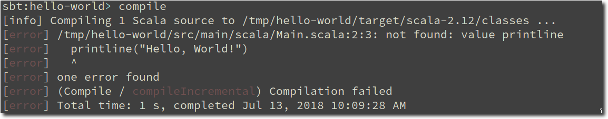
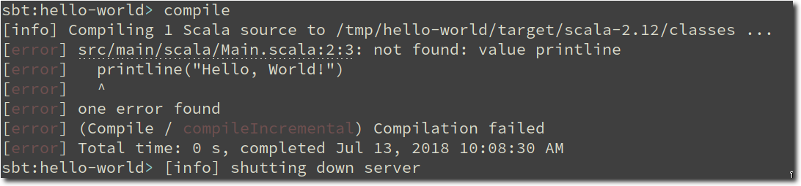

# sbt hyperlink plugin [![travis-badge][]][travis]

[travis]:       https://travis-ci.org/avdv/sbt-hyperlink
[travis-badge]: https://travis-ci.org/avdv/sbt-hyperlink.svg?branch=master

A plugin to hyperlink files from error messages on the console

Before:



After:


A link is generated using ANSI escape sequences and the path is shortened. Clicking the link opens your editor at the referenced line and column.

## Usage

This plugin requires sbt 1.0.0+

Add this to your `~/.sbt/1.0/plugins/plugins.sbt`:

```scala
addSbtPlugin("de.cbley" % "sbt-hyperlink" % "0.0.1")
```

You need a terminal emulator which supports hyperlinks. Here is a
[comprehensive list](https://gist.github.com/egmontkob/eb114294efbcd5adb1944c9f3cb5feda#supporting-apps).

I am using [Termite](https://github.com/thestinger/termite). _(Note, you need to set
the `hyperlinks` option to `true` in your config which is by default `false`)_

By default, `file://` links will be generated for any absolute path to a file of the project in the format:
```
baseDirectory/path/file:line[:column]:
```
which matches paths in compiler error messages like:
```
src/main/scala/sbthyperlink/HyperlinkPlugin.scala:36:1: not found: value xxx
```
Clicking on these links opens the file using the default application associated with the file type.

Unfortunately, that method does not support specifying the line and column number to open. If you want to position the 
cursor at the specified line (or column), have a look at [termlink](termlink/).

### Testing

Run `test` for regular unit tests.

Run `scripted` for [sbt script tests](http://www.scala-sbt.org/1.x/docs/Testing-sbt-plugins.html).
